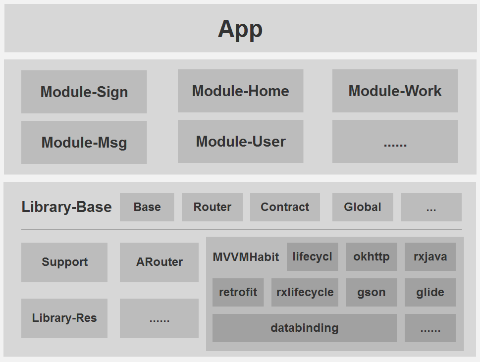
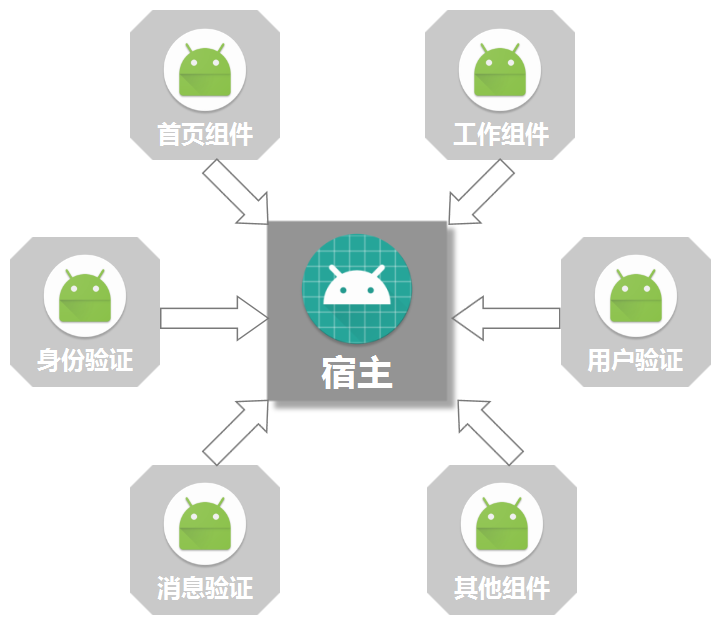

# MVVMHabitComponent
关于Android的组件化，相信大家并不陌生，网上谈论组件化的文章，多如过江之鲫，然而一篇基于MVVM模式的组件化方案却很少。结合自身的调研和探索，在此分享一篇基于[MVVMHabit](https://github.com/goldze/MVVMHabit)框架的一套Android-Databinding组件化开发方案。目标是让学习了此方案的开发人员都可以搭建MVVM组件化项目。

##
> 如果不了解MVVMHabit的可以先学习下：[戳我去MVVMHabit](https://github.com/goldze/MVVMHabit)
## 整体架构
 

## 1、前言

### 1.1、MVVM的优势
想必熟悉前端的朋友对MVVM非常了解，这种模式在目前web前端火的一塌糊涂，比如vue、angular、react都是采用MVVM设计模式实现的前端框架。而在Android开发中，MVVM并不是唯一的架构模式，最常用的可能是MVC模式（通常不是理想的实现）。比较流行的是MVP，它在某种程度上与MVVM模式非常相似。不过MVVM在MVP的基础上更进一步的提高了开发效率，拥有了数据绑定的能力。说到Android MVVM，很自然的联想到谷歌出的Databinding，它提供了xml与java的完美绑定，就像html与js的绑定一样。虽然Android端的MVVM还不是很火，但我相信它是一种趋势。趁着web前端MVVM的热度，移动前端也应该崛起了。
### 1.2、组件化开发

 

### 1.3、MVVM模式+组件化

## 2、项目搭建

### 2.1、创建项目

### 2.2、gradle配置

### 2.3、组件分离

## 3、方案分析